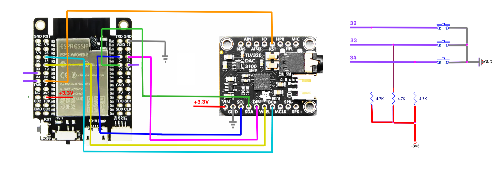

## Roku Private Listening with TLV320DAC3100 on ESP32 code coming soon

PCB is open source://oshwlab.com/ekhalilov/rokurc

This project is about creating a Roku Private Listening device using Adafruit  TLV320DAC3100 dev board connected to TTGO T7 Mini32 V1.5 ESP32-WROVER-B dev board. Added three buttons for volume control.

Adafruit TLV320DAC3100 I2S DAC with Headphone Out
https://github.com/adafruit/Adafruit-TLV320DAC3100-I2S-DAC-PCB

TTGO T7 Mini32 V1.5 ESP32-WROVER-B
https://github.com/LilyGO/TTGO-T7-Demo
